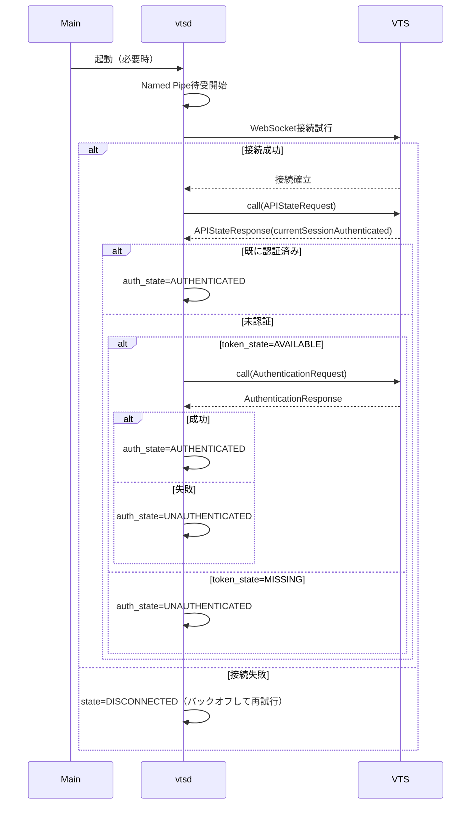
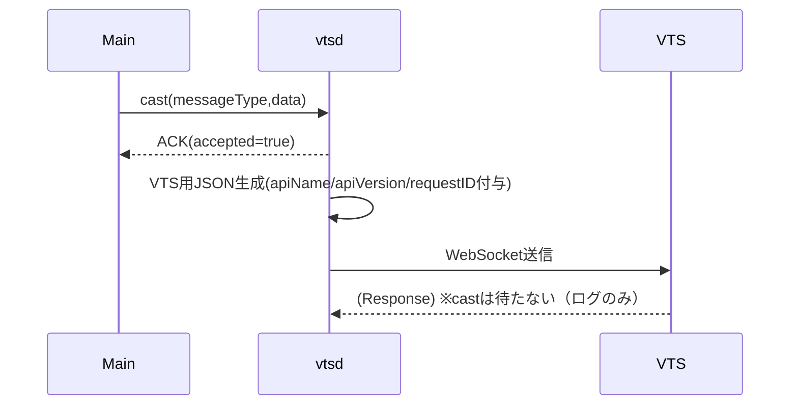
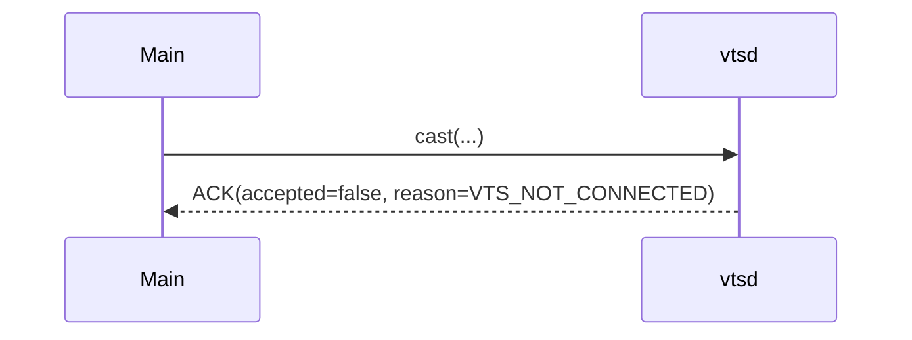
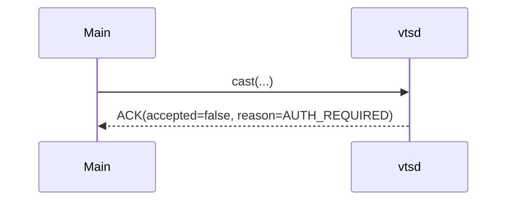
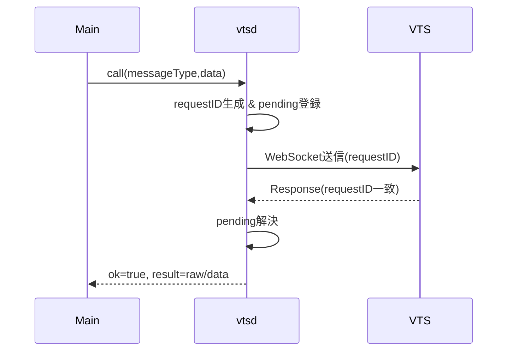
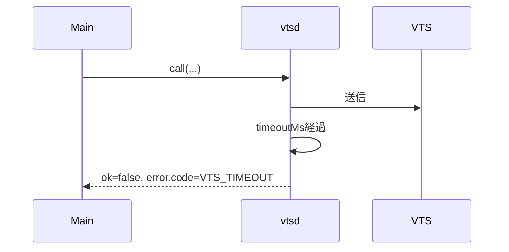
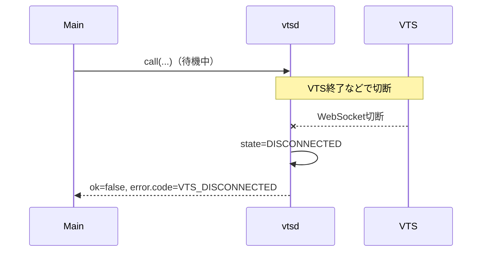

# VTube Studio API 通信デーモン仕様書（vtsd）v0.4（Windows）

## 0. 目的
- VTube Studio（以下 VTS）の Public API（WebSocket）通信を **専用デーモン（vtsd）に分離**し、メイン処理（Python）をブロックしない。
- メイン→vtsd に渡す情報は最小限（**messageType と必要な data のみ**）とし、VTS向けJSON（apiName/apiVersion/requestID 等）は vtsd が生成する。
- 取得系（Getting系など）は応答待ち（call）、操作系は投げっぱなし（cast）を基本とし、メインの邪魔をしない。
- APIは以下URLを参照
  https://github.com/DenchiSoft/VTubeStudio/?tab=readme-ov-file#requesting-list-of-available-items-or-items-in-scene

---

## 1. 対象環境・前提
- OS：Windows 10/11
- メイン：Pythonプロセス（本仕様では「Main」と呼ぶ）
- デーモン：vtsd（本仕様対象）
- VTS：Windows版（ローカル WebSocket API）
- VTS WebSocket 既定：`ws://localhost:8001`（VTS側で変更され得る）

---

## 2. スコープ
### 2.1 すること
- Main ↔ vtsd 間の IPC（Named Pipe）を提供
- vtsd ↔ VTS の WebSocket 接続維持／自動再接続
- VTS API呼び出しを `cast` / `call` で仲介
- セッション認証（Authentication）を vtsd が管理
- エラー・タイムアウト・切断時の規定動作を提供

### 2.2 しないこと（v0.4）
- VTS Event API の購読結果を Main に push 配信する（将来拡張）
- 外部公開（LAN/インターネット越しのアクセス）
- Windows Service 化（LocalSystem 等での起動は想定しない）

---

## 3. 用語
- **Token（認証トークン）**：`AuthenticationTokenRequest` で取得する永続的な資格情報。
- **Session（セッション）**：vtsd と VTS の **WebSocket接続1本**。
- **Session Authentication（セッション認証）**：当該セッションが認証済みである状態。
- **auth_state**：現在のセッションに対する認証状態（後述）。

> 規定：**認証は“セッション単位”**  
> 同じWebSocket接続（セッション）を維持している間は、接続直後に認証しておけば以後のAPI呼び出しで毎回認証処理を挟まない。  
> ただし、切断／再接続でセッションが変われば再認証が必要（Tokenがあれば自動再認証を試行）。

---

## 4. 全体構成
- Main（Python）
  - Named Pipe で vtsd に命令送信
  - `cast` は即戻り（ACKのみ）、`call` は応答を待つ
- vtsd（常駐）
  - Named Pipe サーバ
  - VTS WebSocket クライアント
  - 送信キュー、応答待ち（pending）管理
  - 再接続と認証管理
- VTS（外部コンポーネント）
  - WebSocketで JSON（テキスト）を受け付け、JSON（テキスト）で応答

---

## 5. IPC仕様（Main ↔ vtsd）

### 5.1 トランスポート
- Named Pipe（ローカルのみ）
- 既定：`\\.\pipe\vtsd`
- アクセス範囲：同一マシン内のみ（外部アクセス不可）

### 5.2 フレーミング
- **NDJSON（1行=1 JSON）**
  - リクエスト：`<json>\n`
  - レスポンス：`<json>\n`

### 5.3 リクエスト（Main → vtsd）
```json
{
  "op": "cast" | "call",
  "messageType": "APIStateRequest",
  "data": { ... },                // 任意
  "clientRequestId": "任意",       // 推奨（ログ相関用）
  "timeoutMs": 5000,              // callのみ、任意
  "responseMode": "raw" | "data"  // callのみ、任意
}
````

* `op`

  * `cast`：投げっぱなし。VTS応答は待たない（ただし vtsd は即ACK返却）
  * `call`：応答待ち。VTS応答（またはタイムアウト）を待って返す
* `messageType`：VTS API の messageType
* `data`：VTSリクエストの data 相当（必要な場合のみ）
* `clientRequestId`：Main側で追跡したい任意文字列（未指定可）
* `timeoutMs`：`call` のみ。未指定時は `default_call_timeout_ms`
* `responseMode`

  * `raw`：VTSからの応答JSON全体を `result` に返す
  * `data`：応答JSONの `data` フィールドのみを `result` に返す（メイン負荷軽減）

### 5.4 レスポンス（vtsd → Main）

#### 5.4.1 cast のACK

```json
{
  "ok": true,
  "clientRequestId": "...",
  "accepted": true | false,
  "reason": "VTS_NOT_CONNECTED | AUTH_REQUIRED | QUEUE_FULL | IPC_BAD_REQUEST"
}
```

* 規定：`accepted=true` は「vtsdが送信処理として受理した」であり、VTSが実行した保証ではない。
* 規定：VTS未接続時は `accepted=false` を即返す（キュー保持しない）。

#### 5.4.2 call の成功

```json
{
  "ok": true,
  "clientRequestId": "...",
  "result": { ... }   // raw または data
}
```

#### 5.4.3 共通エラー

```json
{
  "ok": false,
  "clientRequestId": "...",
  "error": {
    "code": "IPC_BAD_REQUEST | VTS_NOT_CONNECTED | VTS_TIMEOUT | VTS_DISCONNECTED | VTS_API_ERROR | AUTH_REQUIRED | INTERNAL",
    "message": "human readable",
    "detail": { ... }
  }
}
```

---

## 6. vtsd ⇄ VTS（WebSocket）仕様

### 6.1 接続先

* 既定：`ws://localhost:8001`
* ポート変更に備え、設定で変更可能（`vts_port`）

### 6.2 送信形式（vtsd → VTS）

* vtsd は必ず以下を付与して送信する：

  * `apiName` = `"VTubeStudioPublicAPI"`
  * `apiVersion` = `"1.0"`
  * `requestID` = vtsd が生成（UUID推奨）
  * `messageType` = Mainから受領
  * `data` = Mainから受領（任意）
* 送信は **テキスト(JSON)** を基本とする

### 6.3 応答処理（VTS → vtsd）

* vtsd は受信ループを常時稼働させる
* `requestID` により `pending_calls` を解決する
* 将来フィールド追加があり得るため、**未知フィールドを許容**し、デシリアライズで破壊しない

---

## 7. 認証（セッション単位）の規定

### 7.1 内部状態

* `vts_connection_state`：`DISCONNECTED / CONNECTING / CONNECTED`
* `token_state`：`MISSING / AVAILABLE`
* `auth_state`：`UNKNOWN / UNAUTHENTICATED / AUTHENTICATED`

  * **auth_state は現在の WebSocket セッションに対する状態**

### 7.2 認証ポリシー（規定）

* vtsd は WebSocket が `CONNECTED` になったタイミングで、以下を実行して **セッション認証を確立**する。

  1. `APIStateRequest`（call）で `currentSessionAuthenticated` を確認
  2. `true` なら `auth_state=AUTHENTICATED`
  3. `false` なら

     * `token_state=AVAILABLE` の場合：`AuthenticationRequest`（call）を1回試行

       * 成功 → `auth_state=AUTHENTICATED`
       * 失敗 → `auth_state=UNAUTHENTICATED`
     * `token_state=MISSING` の場合：`auth_state=UNAUTHENTICATED`

* **通常のAPI呼び出しでは毎回認証しない**（認証は接続時/再接続時に集約）

### 7.3 認証未完了時の扱い（規定）

* `auth_state != AUTHENTICATED` のとき

  * `cast`：`accepted=false reason=AUTH_REQUIRED`
  * `call`：`ok=false error.code=AUTH_REQUIRED`
* 例外：認証そのものに関するAPI（Token取得・AuthenticationRequest）は、実装上 `call` として扱ってよい。

### 7.4 Token取得（運用ルール）

* Tokenが未取得（`token_state=MISSING`）の場合、vtsd は以下のいずれかの運用を選べる。

  * **手動モード（既定推奨）**：Mainが明示的に Token取得操作（AuthenticationTokenRequest相当）を指示した時のみ行う
  * 自動モード：初回に AUTH_REQUIRED となったタイミングで vtsd が Token取得を開始する（VTS側に許可UIが出る）
* v0.4では既定を **手動モード**とし、設定で自動モードにできる（`auto_token_request`）。

---

## 8. `cast` の未接続時挙動（確定事項）

* `vts_connection_state != CONNECTED` の場合

  * `cast` は **キューしない**
  * 即 `accepted=false reason=VTS_NOT_CONNECTED` を返す

---

## 9. 送信キューと同時実行

### 9.1 送信キュー

* vtsd は VTSへの送信を単一の送信タスクが順次処理する（VTSを詰まらせないため）
* キュー上限：`max_queue_size`（既定 1024）

  * 溢れた場合：

    * `cast`：`accepted=false reason=QUEUE_FULL`
    * `call`：`ok=false error.code=INTERNAL`（detailにQUEUE_FULL）または `QUEUE_FULL` を使用してもよい（実装で統一）

### 9.2 call の同時実行

* `call` は複数同時に成立可能
* `pending_calls[requestID] = Future` を保持し、受信側で解決

### 9.3 タイムアウト

* `call` は `timeoutMs`（未指定時は `default_call_timeout_ms`）でタイムアウト
* タイムアウト後に遅れて応答が来た場合は破棄し、必要ならログのみ

---

## 10. エラーコード（規定）

* `IPC_BAD_REQUEST`：op/messageType不正、JSON不正等
* `VTS_NOT_CONNECTED`：VTS WebSocket 未接続
* `VTS_DISCONNECTED`：待機中に切断が発生（callに対して返す）
* `VTS_TIMEOUT`：callがタイムアウト
* `VTS_API_ERROR`：VTSからエラー応答（詳細はdetailへ）
* `AUTH_REQUIRED`：セッション未認証で実行不可
* `INTERNAL`：vtsd内部例外

---

## 11. 動作シーケンス（仕様に含める）

### 11.1 起動〜接続〜セッション認証



### 11.2 cast（接続中・認証済み）



### 11.3 cast（VTS未接続：確定）



### 11.4 cast（未認証：AUTH_REQUIRED）



### 11.5 call（成功）



### 11.6 call（タイムアウト）



### 11.7 VTS切断中のcall（待機中に切断）



---

## 12. API分類（運用ルール）

> ここは “messageTypeの網羅一覧” ではなく、Mainが op を選びやすいようにする分類ルールと代表例。

### 12.1 call 必須（取得・確認）

* 状態取得、一覧取得、結果で分岐する処理
* 代表例（想定）：

  * `APIStateRequest`
  * `StatisticsRequest`
  * `CurrentModelRequest` / `ModelListRequest` 系
  * `HotkeyListRequest` 系
  * `ItemListRequest` 系
  * `EventSubscriptionRequest` / `EventUnsubscriptionRequest`（成否を取りたい場合）
  * 認証系：`AuthenticationTokenRequest` / `AuthenticationRequest`

### 12.2 cast 推奨（操作・発火）

* 代表例（想定）：

  * `HotkeyTriggerRequest`
  * モデル移動・変形・回転系（Transform系）
  * 色味変更（Tint系）
  * アイテムのON/OFFや削除（結果不要運用の場合）
  * モデルロード（結果不要運用の場合）

### 12.3 認証必須の扱い（統一）

* vtsd は **接続確立時にセッション認証を確立**し、以後は `auth_state` でゲートする。
* `auth_state!=AUTHENTICATED` の間は、原則として

  * `cast`：accepted=false（AUTH_REQUIRED）
  * `call`：AUTH_REQUIRED
* 認証そのものの操作（Token取得、AuthenticationRequest）は例外的に許容（call）。

---

## 13. 設定

### 13.1 設定手段

* 設定ファイル：`vtsd.json`（同一フォルダ or `%APPDATA%\vtsd\` など実装で固定）
* 起動引数で上書きしてもよい（実装裁量）

### 13.2 設定項目（案）

```json
{
  "pipe_name": "\\\\.\\pipe\\vtsd",
  "vts_host": "localhost",
  "vts_port": 8001,
  "default_call_timeout_ms": 5000,
  "max_queue_size": 1024,
  "auto_token_request": false,
  "token_path": "%APPDATA%\\vtsd\\token.txt",
  "reconnect_backoff_ms": { "min": 300, "max": 5000 }
}
```

---

## 14. ログ

* 出力：標準出力 + ログファイル（任意）
* ログ内容：

  * 起動/停止
  * VTS接続/切断/再接続
  * セッション認証の結果（成功/失敗）
  * Mainリクエスト受付（clientRequestId, op, messageType）
  * VTS送信（requestID, messageType）
  * エラー（error.code、必要ならスタックトレースはデバッグ時のみ）

---

## 15. セキュリティ方針（Windows前提）

* Named Pipe はローカル限定。可能なら「同一ユーザーのみ」アクセス可能なACLで作成する（実装で対応）。
* トークンはユーザー領域に保存し、他ユーザーから読めない権限にする。

---

## 16. 非機能要件

* 低オーバーヘッド：Main→vtsdは最小JSON、vtsdがVTS JSONを生成
* 非ブロッキング：

  * cast：即ACK
  * call：必要な場合のみ待機
* 堅牢性：

  * VTS未起動/再起動でもvtsdが落ちない
  * 切断時は自動再接続
  * pending(call) は切断時に即失敗で返す
* 互換性：未知フィールドが来ても壊れない

---

## 17. サンプル（NDJSON）

### 17.1 API状態取得（call）

Main → vtsd：
`{"op":"call","messageType":"APIStateRequest","clientRequestId":"m-001","responseMode":"data"}`
vtsd → Main：
`{"ok":true,"clientRequestId":"m-001","result":{"active":true,"currentSessionAuthenticated":false}}`

### 17.2 ホットキー発火（cast）

Main → vtsd：
`{"op":"cast","messageType":"HotkeyTriggerRequest","data":{"hotkeyID":"abc"},"clientRequestId":"m-010"}`
vtsd → Main（接続中・認証済み）：
`{"ok":true,"clientRequestId":"m-010","accepted":true}`

vtsd → Main（未接続）：
`{"ok":true,"clientRequestId":"m-010","accepted":false,"reason":"VTS_NOT_CONNECTED"}`

---

## 18. 将来拡張

* Event API購読 → Mainへのpush配信（pub/sub）
* IPCの高速化：MessagePack + length-prefix化
* opを opcode化して payloadをさらに削減
* 優先度キュー（hotkey等を優先）
* 複数クライアント接続（複数Main/ツール）

---